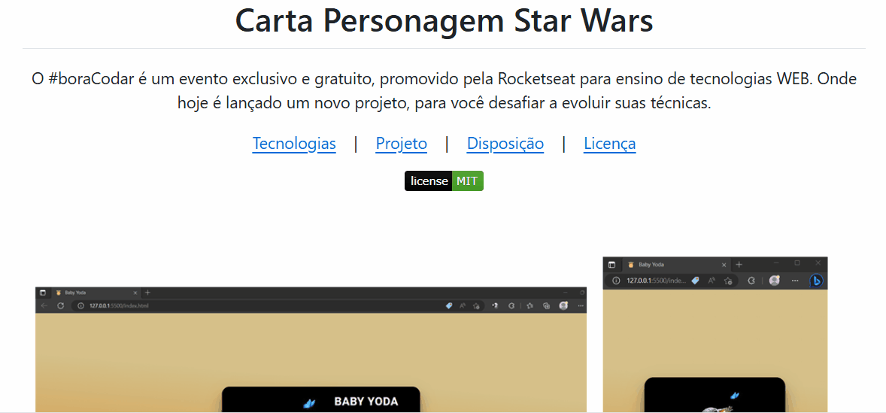

# Projeto com README
Um projeto de teste com um arquivo README 🚀

[](https://br.pinterest.com/pin/629167010433883508/)

## Tecnologias utilizadas

- HTML
- CSS
- JS

## Como utulizar

1 - Clone para o projeto
```
git clone https://github.com/camilam-ribeiro/repositorio-com-readme.git
```
2 - Acesse a pasta do projeto
```
cd repositorio-com-readme
```